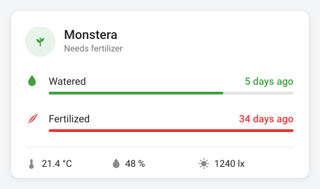

# Plant Care

A Home Assistant integration for plant care: **when was this plant last
watered, and when was it last fertilized** — logged by a single physical
button (ON = water, OFF = fertilizer) — plus its temperature, humidity and
light sensors, shown on a bundled Lovelace card.



One HACS install, one config-flow form per plant. No YAML, no helpers to
create, no Lovelace resource to register.

## How it works

1. A **physical button** (Zigbee/Z-Wave/BLE) exposed as an `event` entity —
   or a switch, or a helper — reports a press.
2. The integration **subscribes to it directly** and stamps the matching
   timestamp: ON → last watered, OFF → last fertilized. No automation to
   write.
3. The **card** shows each as relative time, coloured green → amber → red as
   the next care date approaches.
4. Tapping a row on the card logs care manually (confirm-on-second-tap), so
   the button doesn't have to be in reach. Setting the `datetime` entity by
   hand backdates care you forgot to log.

## Install

**HACS** — ⋮ → *Custom repositories* → add
`https://github.com/albertsola/homeassistant-plant` with type
**Integration** → install **Plant Care** → restart Home Assistant.

**Manual** — copy `custom_components/plant_care/` into your `<config>/custom_components/`
and restart.

Then **Settings → Devices & Services → Add Integration → Plant Care**.

The form asks for the plant's name and, optionally, its button, its sensors
and the care intervals. Everything except the name can be changed later from
the integration's *Configure* link. Add one entry per plant.

The card is served by the integration and registered with the frontend
automatically — there is no Lovelace resource to add. Because it is loaded as
a frontend module rather than a dashboard resource, it does **not** appear
under *Settings → Dashboards → Resources*; that list is only for manually
added resources. It still shows up in the card picker, which is the list that
matters when building a dashboard.

If you previously added `/local/plant-card.js` as a resource by hand, remove
it. Leaving it is harmless — the card guards against being registered twice —
but it loads the file a second time for nothing.

## The card

Add it the normal way: **Add card → Plant Card**, at the bottom of the dialog
under **Community cards** (that is what Home Assistant calls the section
holding cards it did not ship). It appears in the picker with a live preview and has a visual
editor, so no YAML is needed. Note that the card only shows up once at least
one plant has been added, because that is what starts the integration. In YAML it
is one line:

```yaml
type: custom:plant-card
entity: sensor.monstera_plant
```

That's the whole configuration. The summary entity carries the plant's name,
timestamps, intervals and sensor entity IDs, and the card reads them from
there.

Anything set explicitly still wins:

| Option | Type | Default | Description |
| --- | --- | --- | --- |
| `entity` | entity | – | A Plant Care summary entity. Supplies every option below. |
| `last_watered` | entity | – | A `datetime` or `input_datetime` entity. Required if `entity` is not set. |
| `last_fertilized` | entity | – | Same for fertilizer. Absent → the row is hidden. |
| `name` | string | `Plant` | Card title. |
| `icon` | icon | `mdi:flower` | Avatar icon. |
| `image` | url | – | Photo instead of the icon, e.g. `/local/plants/monstera.jpg`. |
| `water_interval` | number | `7` | Days before watering counts as overdue. |
| `fertilize_interval` | number | `30` | Days before fertilizing counts as overdue. |
| `temperature` | entity | – | Sensor shown in the bottom row. |
| `humidity` | entity | – | Sensor shown in the bottom row. |
| `illuminance` | entity | – | Sensor shown in the bottom row. |
| `moisture` | entity | – | Soil moisture sensor shown in the bottom row. |
| `water_label` | string | `Watered` | Row label. |
| `fertilize_label` | string | `Fertilized` | Row label. |
| `water_noun` | string | `water` | Used in the "Needs …" subtitle. |
| `fertilize_noun` | string | `fertilizer` | Used in the "Needs …" subtitle. |
| `tap_to_log` | bool | `true` | Tapping a care row logs that care event. |
| `confirm` | bool | `true` | Require a second tap within 4 s before logging. |
| `show_progress` | bool | `true` | Thin bar showing elapsed time towards the interval. |
| `water_script` | `script.x` | – | Call this instead of writing the timestamp directly. |
| `fertilize_script` | `script.x` | – | Same, for fertilizer. |

Relative times are localized with the frontend's language. Tapping a sensor
opens its more-info dialog. More examples in `lovelace-example.yaml`.

## Entities

Each plant becomes one device:

| Entity | Purpose |
| --- | --- |
| `sensor.<plant>_plant` | Summary: `ok` / `needs_water` / `needs_fertilizer` / `needs_both`, with everything the card needs in its attributes. |
| `datetime.<plant>_last_watered` | When it was last watered. Settable, so care can be backdated. |
| `datetime.<plant>_last_fertilized` | When it was last fertilized. |
| `sensor.<plant>_days_since_watered` | Days elapsed — graphable, usable in automations. |
| `sensor.<plant>_days_since_fertilized` | Days elapsed. |
| `binary_sensor.<plant>_needs_water` | `on` when past the interval. |
| `binary_sensor.<plant>_needs_fertilizer` | `on` when past the interval. |
| `number.<plant>_watering_interval` | Interval in days, adjustable from the UI. |
| `number.<plant>_fertilizing_interval` | Interval in days. |
| `button.<plant>_log_watering` | Log watering now, from the UI or an automation. |
| `button.<plant>_log_fertilizing` | Log fertilizing now. |

Care history is persisted in HA's storage, so it survives restarts and
reloads.

## "Plant Card" is not in the card picker

Work through these in order — the first two catch almost every case.

1. **Add a plant first.** The card is registered by the integration, and Home
   Assistant only starts an integration once it has at least one entry. Until
   a plant exists under *Settings → Devices & Services → Plant Care*, the card
   cannot appear. Add one, then reload the dashboard.
2. **Restart Home Assistant, then hard-refresh the browser**
   (`Ctrl`/`Cmd` + `Shift` + `R`). Installing a custom integration needs a
   restart before HA will load it, and the frontend caches its module list.
3. **Check the card is being served.** Open
   `http://<your-ha>:8123/plant_care/plant-card.js` directly. You should see
   JavaScript. A 404 means the integration is not set up — go back to step 1.
   Anything else means the file is fine and the problem is in the browser.
4. **Confirm HACS installed it as an integration.** If *Plant Care* does not
   appear under *+ Add Integration* at all, HACS probably still has this
   repository added with the old **Dashboard** category, which drops the files
   in the wrong place. Remove it from HACS and re-add it as type
   **Integration**.
5. **Look in the right place in the picker.** Cards from outside Home
   Assistant sit in a separate collapsible **Community cards** section at the
   bottom of the *Add card* dialog. Searching `plant` finds it wherever it is.
   If that section is missing entirely, no custom card module has loaded at
   all — go back to step 1.
6. **Check the browser console** for errors mentioning `plant-card`. A
   duplicate registration from an old manual resource used to break this;
   remove `/local/plant-card.js` from *Settings → Dashboards → Resources* if
   it is still there.

## Buttons

Any `event`, `switch`, `binary_sensor` or `input_boolean` entity works. The
setup form asks which value means watering (default `on`) and which means
fertilizing (default `off`). Common variants — `turn_on`, `on_press`,
`press_on`, `single`, and their off/double counterparts — are matched
automatically, so most remotes work untouched. For anything else, type the
exact event type, e.g. `1_single`.

One subtlety this handles for you: on an `event` entity, pressing the same
button twice does **not** change the `event_type` attribute — only the
entity's state (the press timestamp) changes. An automation triggering on
`attribute: event_type` silently drops repeat presses. The integration
watches the state and reads the type from it, so watering twice in a week is
recorded twice.

## Reminders

`binary_sensor.<plant>_needs_water` is a `problem` sensor, so a reminder is a
two-line automation:

```yaml
trigger:
  - platform: state
    entity_id: binary_sensor.monstera_needs_water
    to: "on"
    for: "01:00:00"
action:
  - service: notify.persistent_notification
    data:
      message: Monstera needs water.
```

## Without the integration

`packages/plant_care.yaml` is the original YAML-only build — `input_datetime`
helpers, a button automation and template sensors — for anyone who would
rather not install a custom integration. It needs the card installed
manually: copy `custom_components/plant_care/www/plant-card.js` to
`<config>/www/` and add `/local/plant-card.js` as a JavaScript module
resource. The card's explicit options (`last_watered`, `temperature`, …)
exist for exactly this case.

## Development

```bash
pip install -r requirements-test.txt
pytest
```

The suite boots Home Assistant, sets up a config entry, and drives real
button presses through it — including the repeat-press case above.
